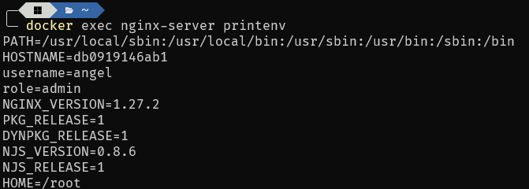
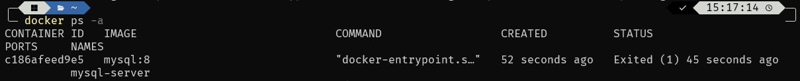
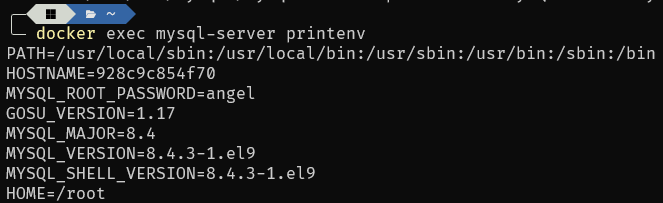

# Variables de Entorno
### ¿Qué son las variables de entorno?

Las variables de entorno son pares clave-valor almacenados en el sistema operativo que proporcionan información de configuración o controlan el comportamiento de aplicaciones y procesos en un entorno específico.

### Para crear un contenedor con variables de entorno

```
docker run -d --name <nombre contenedor> -e <nombre variable1>=<valor1> -e <nombre variable2>=<valor2>
```

### Crear un contenedor a partir de la imagen de nginx:alpine con las siguientes variables de entorno: username y role. Para la variable de entorno rol asignar el valor admin

```
docker run -d --name nginx-server -e username=angel -e role=admin nginx:alpine
```



### Crear un contenedor con mysql:8 , mapear todos los puertos

```
docker run -P -d --name mysql-server mysql:8
```

### ¿El contenedor se está ejecutando?

El contenedor mysql-server no se esta ejecutando.

```
docker ps -a
```



### Identificar el problema

```
docker logs mysql-server
```

Al ingresar a los logs del contenedor, se observa que el problema se debe a la falta de variables de entorno para especificar una contraseña de root para el contenedor.

### Eliminar el contenedor creado con mysql:8

```
docker rm mysql-server
```

### Para crear un contenedor con variables de entorno especificadas
- Portabilidad: Las aplicaciones se vuelven más portátiles y pueden ser desplegadas en diferentes entornos (desarrollo, pruebas, producción) simplemente cambiando el archivo de variables de entorno.
- Centralización: Todas las configuraciones importantes se centralizan en un solo lugar, lo que facilita la gestión y auditoría de las configuraciones.
- Consistencia: Asegura que todos los miembros del equipo de desarrollo o los entornos de despliegue utilicen las mismas configuraciones.
- Evitar Exposición en el Código: Mantener variables sensibles como contraseñas, claves API, y tokens fuera del código fuente reduce el riesgo de exposición accidental a través del control de versiones.
- Control de Acceso: Los archivos de variables de entorno pueden ser gestionados con permisos específicos, limitando quién puede ver o modificar la configuración sensible.

Previo a esto es necesario crear el archivo y colocar las variables en un archivo, **.env** se ha convertido en una convención estándar, pero también es posible usar cualquier extensión como **.txt**.
```
docker run -d --name <nombre contenedor> --env-file=<nombreArchivo>.<extensión> <nombre imagen>
```
**Considerar**
Es necesario especificar la ruta absoluta del archivo si este se encuentra en una ubicación diferente a la que estás ejecutando el comando docker run.

### Crear un contenedor con mysql:8 , mapear todos los puertos y configurar las variables de entorno mediante un archivo

```
docker run -P -d --name mysql-server --env-file=mysqlServerEnv.txt mysql:8
```



### ¿Qué bases de datos existen en el contenedor creado?

```
docker exec -it mysql-server mysql -u root -p -e "SHOW DATABASES;"
```

Al ejecutar el comando nos pedira la contraseña del root de mysql, la cual es la que se 
establecido en las variables de entorno, luego se muestran las base de datos existente, en este caso
aparecen: information_schema, mysql, performance_schema, sys.
