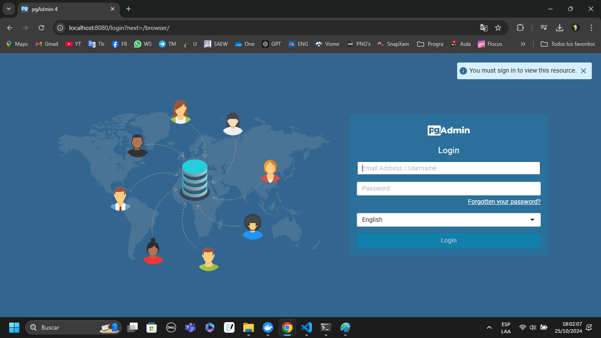
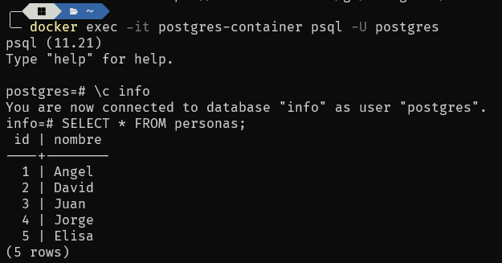

### Crear contenedor de Postgres sin que exponga los puertos. Usar la imagen: postgres:11.21-alpine3.17

```
docker run -d --name postgres-container -e POSTGRES_PASSWORD=angel postgres:11.21-alpine3.17
```

Cabe mencionar que en este caso el usuario por defecto será 'postgres'.

### Crear un cliente de postgres. Usar la imagen: dpage/pgadmin4

```
docker run -d --name postgres-client -e PGADMIN_DEFAULT_EMAIL=angelch@gmail.com -e PGADMIN_DEFAULT_PASSWORD=angel -p 8080:80 dpage/pgadmin4
```

La figura presenta el esquema creado en donde los puertos son:

- a: 8080
- b: 80
- c: 5432


## Desde el cliente

### Acceder desde el cliente al servidor postgres creado
Cabe mencionar, que para crear el servidor en pgAdmin ha sido necesario crear una red en docker para facilitar el proceso de conexión.

```
docker network create pg-network
docker network connect pg-network postgres-container
docker network connect pg-network postgres-client
```



### Crear la base de datos info, y dentro de esa base la tabla personas, con id (serial) y nombre (varchar), agregar un par de registros en la tabla, obligatorio incluir su nombre.

## Desde el servidor postgresl
### Acceder al servidor
### Conectarse a la base de datos info

```
docker exec -it postgres-container psql -U postgres

\c info
```

### Realizar un select *from personas

